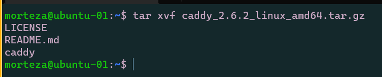
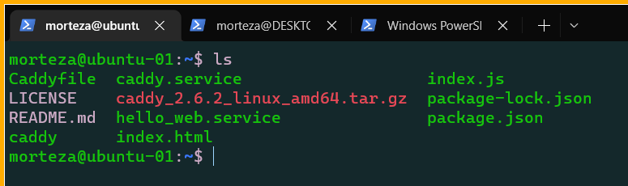

# Assignment 2

## Step 1: Setup
We need the following set up on DigitalOcean:
- VPC
- 2 Droplets
- Load Balancer
- Firewall


This was done by following this video guide: https://vimeo.com/775412708/4a219b37e7

## Step 2: Create a new regular user on both of your droplets

Regular user made for each droplet with 

## Step 3: Install a Web server with Caddy
First install Caddy in your server:
```
wget https://github.com/caddyserver/caddy/releases/download/v2.6.2/caddy_2.6.2_linux_amd64.tar.gz
```
Once the file is in your directory, extract it
```
tar xvf caddy_2.6.2_linux_amd64.tar.gz
```

Once extracted, give root access and move file to /usr/bin/
```
sudo chown root: caddy
sudo cp caddy /usr/bin/
```

# Step 4: Create Web App
Use WSL to create a directory for assignment 2 with two subdirectories:
- html
- src
then vim index.html in the html directory and include the following:
```
<!DOCTYPE html>
<html lang="en">
<head>
    <meta charset="UTF-8">
    <meta http-equiv="X-UA-Compatible" content="IE=edge">
    <meta name="viewport" content="width=device-width, initial-scale=1.0">
    <title>Assignment 2</title>
</head>
<body>
    <h1>Welcome to the end of this semester</h1>
    <p>You will be missed.</p>
</body>
</html>
```
Then inside of the src directory create a new node project:
```
npm init
npm i fastify
vim index.js
```
Inside the index.js file, include the below modified script:
```
// Require the framework and instantiate it
const fastify = require('fastify')({ logger: true })

// Declare a route
fastify.get('/api', async (request, reply) => {
  return { hello: 'Server x' }
})

// Run the server!
const start = async () => {
  try {
    await fastify.listen({ port: 5050 })
  } catch (err) {
    fastify.log.error(err)
    process.exit(1)
  }
}
start()
```
Lastly, we will install Node with Volta in WSL
```
# install Volta
curl https://get.volta.sh | bash
source ~/.bashrc

# install Node
volta install node
```
This will allow us to test our server locally.

## Step 5: Write your Caddyfile
Create caddyfile and caddy.service using WSL:
```
vim caddyfile

# Enter this inside the file

http://24.199.69.40 {
    root * /var/www
    reverse_proxy /api localhost:5050
    file_server
}
```
```
vim caddy.service

# Enter this inside the service file

[Unit]
Description=Serve HTML in /var/www using caddy
After=network.target

[Service]
Type=notify
ExecStart=/usr/bin/caddy run --config /etc/caddy/Caddyfile
ExecReload=/usr/bin/caddy reload --config /etc/caddy/Caddyfile
TimeoutStopSec=5
KillMode=mixed

[Install]
WantedBy=multi-user.target
```
## Step 6: Install Node with Volta on both Droplets
```
# install Volta
curl https://get.volta.sh | bash
source ~/.bashrc

# install Node
volta install node
```

## Step 7: Create hello_web.service file
```
[Unit]
Description=service file to start your node application and should restart the service on failure.
After=network-online.target

[Service]
User=morteza
Group=morteza
Type=notify
ExecStart=/home/morteza/.volta/bin/node /home/morteza/2420-assignment-2/src/index.js
Restart=on-failure

[Install]
WantedBy=multi-user.target
```

## Step 8: Move Files to both Droplets Using WSL SFTP
Connect to droplet from wsl using sftp:
```
sftp -i ~/.ssh/DO_key morteza@143.198.158.245
put caddy.service
put Caddyfile
put hello_web.service

# from html subdirectory
put index.html

# from src subdirectory
put index.js
put package.json
put package-lock.json
```
Repeat the above but change the ip address to your other droplet:
```
sftp -i ~/.ssh/DO_key morteza@143.198.147.110
```
Should now have all the relevant files inside the droplet home directory of morteza:




Now let's move the files into the correct directories. Repeat for both droplets:
```
sudo cp caddy.service /etc/systemd/system/caddy.service
sudo cp hello_web.service /etc/systemd/system/hello_web.service
sudo cp Caddyfile /etc/caddy/Caddyfile
sudo cp index.html /var/www/index.html
```
sudo vim into the index.html file and change the files to be differentiable from one another. I changes the header title to specify which droplet it is in.

Once that is done, and your index.js file is where you specified it to be inside your hello_web.service file (in my case, at ~/2420-assignment-2/src/index.js), we can enable start and test our service files:
```
systemctl enable caddy.service
systemctl start caddy.service
systemctl status caddy.service
```

Before enabling hello_web.service, we will need to install fastify in the directory holding our index.js file.
```
npm init
npm i fastify
```

Then continue to enable the service file:

```
systemctl enable hello_web.service
systemctl start hello_web.service
systemctl status hello_web.service
```


I changed the index.js slightly to differentiate between the two. You can check that both html files are running by going to your load balancer address (24.199.69.40) and reloading.


## Step 9: Loadbalancer Check API
user curl in your droplet or visit 24.199.69.40/api to see if your index.js is being returned alterating between both servers. It is.
